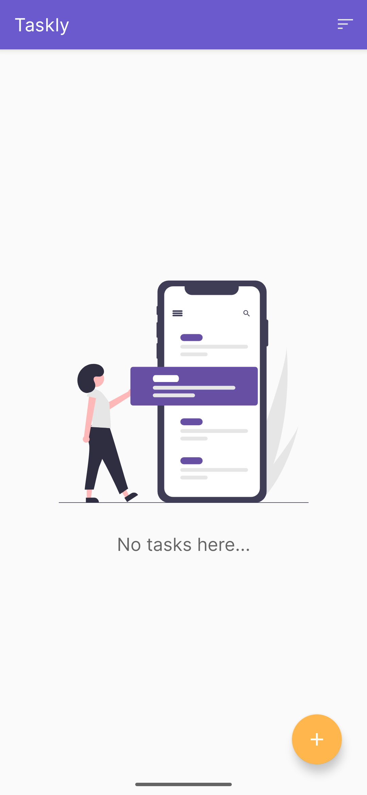

# Taskly


> Taskly is a simple and intuitive To-Do application built with Kotlin and Android.  
> This MVP project demonstrates core Android development concepts and Room persistence,  
> while applying Material Design for a modern UX.  
> Although it started as an MVP, it already includes useful features such as priorities,  
> due dates, task filtering, and sorting.

---

## 💡 Overview

Taskly helps users organize their daily tasks efficiently, providing a simple interface to **create, view, and persist tasks locally**.  
This educational project was developed to consolidate knowledge in Android fundamentals, Room database, and Material Design.

Key concepts covered:

- Basic structure of an Android project
- Usage of `Activity` and lifecycle methods
- Layout creation using XML
- UI components: `TextView`, `EditText`, `Button`, `FloatingActionButton`
- List rendering with `RecyclerView` and custom `Adapter`
- ViewBinding for safer access to views
- Navigation between screens
- Local data persistence using **Room Database** (DAO, entities, queries)
- MVP architecture implementation
- UX improvements with Material Design

> **Note:** This is still treated as a **Minimum Viable Product (MVP)**.  
> Features like reminders, notifications, and cloud sync will be explored in future versions.

---

## 🚀 Technologies

- Kotlin
- Android Studio
- Android SDK / AndroidX
- ViewBinding
- RecyclerView
- Material Components
- Room (SQLite abstraction library)

---

## ✅ Features

**Task Management**
- Create tasks with title and description
- Edit and delete tasks
- Mark tasks as completed
- Local persistence using Room database (DAO, Entity, Database)

**Enhancements**
- Add due dates
- Set priorities (Low, Medium, High)
- Sort and filter tasks

**UX & UI**
- Material Design components
- FloatingActionButton for quick task creation
- Responsive layouts using ConstraintLayout
- Light & Dark mode support

**Architecture & Code Quality**
- MVP pattern for maintainable code
- ViewBinding for safer view access

---

## 📸 Demo

<p align="center">
  
</p>

---

## 📷 Screenshots

<p align="center">
  
  
  
  
</p>

---

## ▶️ How to Run
1. Clone the repository:
```
git clone https://github.com/math-nazario/taskly.git
```
2. Open the project in **Android Studio**
3. Build and run the app on an emulator or physical device
4. Add tasks using the "+" button

---

## 📝 Roadmap

### High Priority ✅ Done
- Edit and delete tasks  
- Mark tasks as completed  

### Medium Priority ⏳ Next
- Task cards with richer UI (icons, better styling) 
- Animations and transitions for improved UX  

### Future Ideas 💡
- Cloud sync with API backend
- Notifications and reminders
- Search and filtering improvements

---

## 📌 Status

This project is an **MVP with incremental improvements**.
It already covers core Android concepts while adding practical features, but still has room for evolution.
